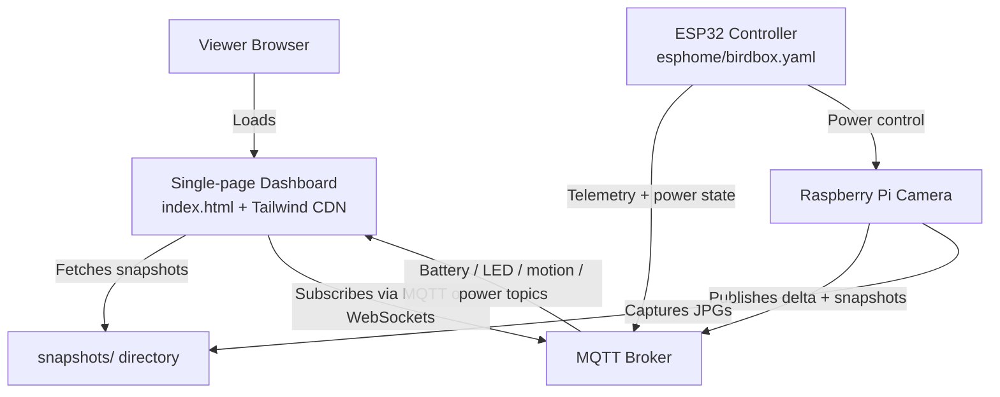

# bird-box

Bird Box is a lightweight, single-page web dashboard for a birdhouse camera. It renders live device status from MQTT topics (battery, LED brightness/color, motion delta, and Pi power state) and displays camera snapshots by reading the `/snapshots/` directory listing, showing each JPG with a timestamp caption and a modal preview. The page refreshes the gallery every 10 seconds, is styled with Tailwind via CDN, and runs entirely in the browser with no build step.

## Platform diagram

## ESPHome controller

The ESP32 configuration that manages battery monitoring and Raspberry Pi power control lives in `esphome/birdbox.yaml`. It publishes battery telemetry over MQTT, publishes Pi power state changes, listens for Pi power commands, and listens for LED brightness/color updates. It also uses configurable on/off thresholds exposed as Home Assistant sliders to auto-toggle Pi power based on battery percentage.

## Snapshots directory

Place camera images in `snapshots/` at the repository root so they are served at `/snapshots/`. The gallery expects JPG filenames in the format `YYYYMMDD_HHMMSS.jpg` so it can format timestamps in the UI. The directory is tracked in Git with a `.gitkeep` placeholder so it exists when you deploy. You will need a separate process to write incoming snapshot MQTT payloads to this directory.

## Raspberry Pi camera script

The Raspberry Pi publishes motion deltas and high-resolution snapshots using `pi/frame_differencing_trigger.py`. It runs Picamera2 in full-auto mode, performs frame differencing, turns on the LED strip over MQTT when motion crosses the threshold, and publishes JPEG bytes to the snapshot topic.

## MQTT topic map

### Telemetry topics (ESP32 + Pi ➜ broker ➜ dashboard)

- `Birdbox/1/Battery/Percent` (battery percentage)
- `Birdbox/1/Battery/Voltage` (battery voltage)
- `Birdbox/1/LED/Brightness` (current LED brightness)
- `Birdbox/1/LED/R`, `Birdbox/1/LED/G`, `Birdbox/1/LED/B` (current LED RGB values)
- `Birdbox/1/delta` (motion delta)
- `Birdbox/1/switch/pi_power/state` (Pi power state)

### Control topics (dashboard/automations ➜ broker ➜ ESP32)

- `Birdbox/1/switch/pi/set` (Pi power on/off)
- `Birdbox/1/LED/Brightness` (LED brightness command)
- `Birdbox/1/LED/R`, `Birdbox/1/LED/G`, `Birdbox/1/LED/B` (LED color commands)

### Camera topics (Pi ➜ broker)

- `Birdbox/1/snapshot` (JPEG snapshot payloads)

Key environment variables:

- `MQTT_BROKER_HOST`, `MQTT_BROKER_PORT`, `MQTT_USERNAME`, `MQTT_PASSWORD`
- `MQTT_DELTA_TOPIC`, `MQTT_SNAP_TOPIC`
- `LED_BRIGHTNESS_TOPIC`, `LED_R_TOPIC`, `LED_G_TOPIC`, `LED_B_TOPIC`
- `LED_BRIGHTNESS_VALUE`, `LED_R_VALUE`, `LED_G_VALUE`, `LED_B_VALUE`, `LED_WARMUP_SEC`
- `MOTION_THRESHOLD`
